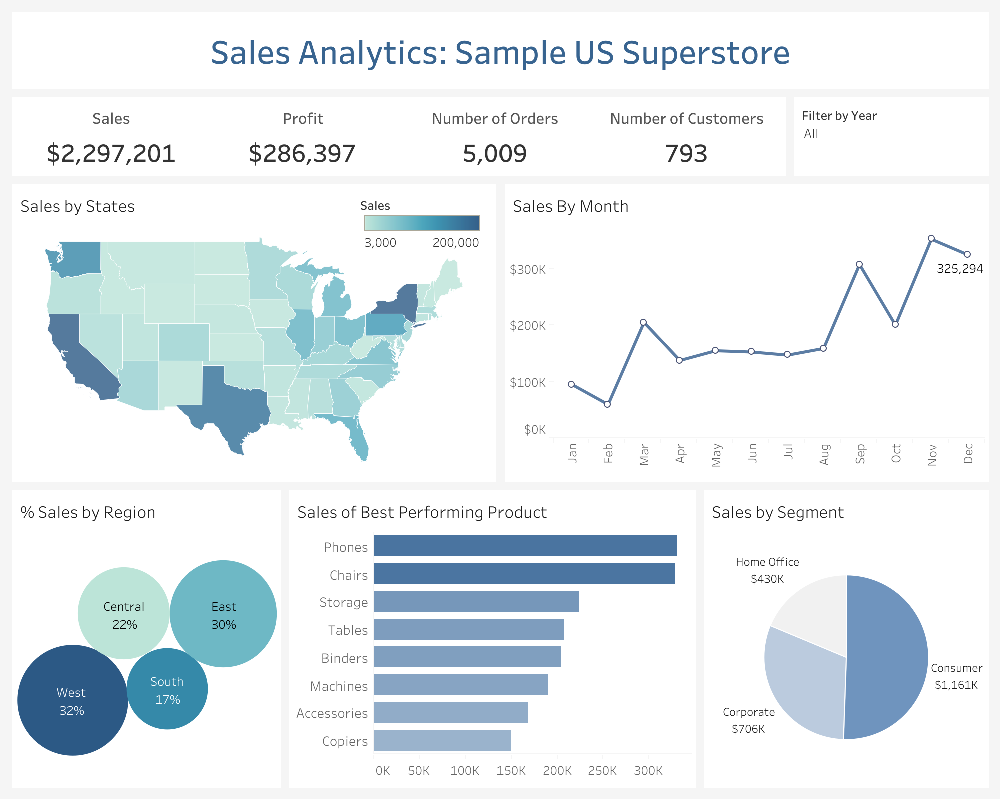

# 📊 Sales Analytics & Visualization – Sample US Superstore

## 📌 Project Overview
This project presents an **end-to-end sales analytics dashboard** built in **Tableau** using the popular *Sample US Superstore* dataset.  
The goal was to analyze sales and profit performance across multiple dimensions — geography, product categories, customer segments, and time — and design an **interactive dashboard** that delivers actionable insights for business stakeholders.

---

## 🎯 Objectives
- Collect, clean, and validate the *Sample Superstore* dataset.  
- Analyze sales trends to identify **regional variations, seasonal spikes, and product performance**.  
- Build a **minimalistic, interactive Tableau dashboard** that communicates key business insights effectively.  
- Provide **recommendations** to improve decision-making and uncover opportunities for growth.

---

## 📈 Key Features
- **KPIs:** Total Sales, Total Profit, Number of Orders, and Unique Customers.  
- **Geographical Analysis:** Map & bubble charts showing top-performing states (CA, NY) and underperforming regions (Central, South).  
- **Sales Trends:** Line chart displaying seasonality with noticeable spikes in **March** and **Q4 (Sept–Dec)**.  
- **Product Insights:** Horizontal bar chart highlighting **phones and chairs** as bestsellers.  
- **Segment Analysis:** Pie chart showing **Consumer segment** contributing nearly half of sales.  
- **Interactivity:**  
  - Year filter to drill down into performance by year.  
  - Hover tooltips with additional details.  
  - Cross-filtering (e.g., selecting March filters all other charts to March data).  

---

## 🛠️ Tools & Technologies
- **Tableau Public** – dashboard creation and visualization  
- **MS Excel / CSV** – data source  
- **Data Cleaning & Validation** – ensured accuracy and consistency before visualization  

---

## 📊 Dashboard Preview

> Click the image above to view the **interactive Tableau dashboard** on Tableau Public.

